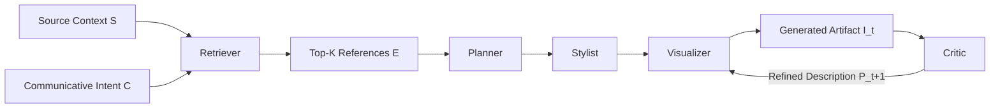

# PaperBanana

[](https://arxiv.org/abs/2601.23265)
[](https://www.python.org/)
[](https://docs.astral.sh/uv/)
[](https://streamlit.io/)

Unofficial, independent reimplementation inspired by **PaperBanana: Automating Academic Illustration for AI Scientists**.

This project builds publication-oriented methodology diagrams and statistical plots through a five-agent workflow:

1. Retriever
2. Planner
3. Stylist
4. Visualizer
5. Critic

Paper: https://arxiv.org/abs/2601.23265

## Disclaimer

- This repository is a third-party reproduction for study and experimentation.
- It is **not** the official implementation and is **not affiliated** with the original paper authors.
- Any implementation differences from the paper are intentional engineering choices for this repo.

## Table of Contents

- [Architecture](#architecture)
- [Quick Start](#quick-start)
- [Run](#run)
- [Dashboard](#dashboard)
- [Input JSON Schemas](#input-json-schemas)
- [Outputs](#outputs)
- [Troubleshooting](#troubleshooting)
- [Development](#development)
- [Citation](#citation)

## Architecture



## Quick Start

### 1) Install dependencies

```bash
uv sync
```

### 2) Configure environment

```bash
cp .env.example .env
```

Required/default values in `.env`:

```env
OPENROUTER_API_KEY=your_key_here
OPENROUTER_MODEL=google/gemini-3-pro-preview
OPENROUTER_BASE_URL=https://openrouter.ai/api/v1
OPENROUTER_SITE_URL=
OPENROUTER_APP_NAME=paperbanana
OPENROUTER_IMAGE_MODEL=google/gemini-3-pro-image-preview
OPENROUTER_IMAGE_MODALITIES=image,text
OPENROUTER_IMAGE_ASPECT_RATIO=21:9
OPENROUTER_IMAGE_SIZE=2K
PAPERBANANA_MAX_ITERATIONS=3
```

### 3) Verify CLI

```bash
uv run paperbanana --help
```

## Run

Mock mode (no external API calls):

```bash
uv run paperbanana run \
  --task-file examples/task.json \
  --references-file examples/reference_pool.json \
  --output-dir outputs \
  --mock
```

OpenRouter mode for diagram generation:

```bash
uv run paperbanana run \
  --task-file examples/task.json \
  --references-file examples/reference_pool.json \
  --output-dir outputs \
  --no-mock
```

OpenRouter mode for plot generation:

```bash
uv run paperbanana run \
  --task-file examples/plot_task.json \
  --references-file examples/reference_pool.json \
  --output-dir outputs \
  --no-mock
```

Useful options:

- `--task-file <path>`
- `--references-file <path>`
- `--output-dir <path>`
- `--style-guide-file <path>`
- `--model-name <model>`
- `--temperature <float>`
- `--top-k <int>`
- `--max-iterations <int>`
- `--mock / --no-mock`
- `--env-file <path>`

## Dashboard

Start UI:

```bash
uv run paperbanana ui
```

Custom env file:

```bash
uv run paperbanana ui --env-file .env
```

Host/port override:

```bash
uv run paperbanana ui --host 0.0.0.0 --port 8501
```

Dashboard flow:

1. Configure runtime values in sidebar (mode, model, temperature, Top-K, max iterations).
2. Enter source context + communicative intent.
3. Upload reference images in **Reference Input**.
4. Click **Generate references from uploaded images**.
5. Review and edit appended `References JSON array`.
6. Click **Run Pipeline**.

Reference image notes:

- Uploaded images are stored in session temp paths (`/tmp/...` or platform-equivalent temp).
- Generated references include `source_context`, `communicative_intent`, `domain`, `diagram_type`, and `image_observation`.
- Image-based reference generation is available in `--no-mock` mode.
- Existing references are preserved; generated entries are appended.

## Input JSON Schemas

Task (`examples/task.json`):

```json
{
  "source_context": "...",
  "communicative_intent": "...",
  "mode": "diagram"
}
```

Plot task (`examples/plot_task.json`):

```json
{
  "source_context": "...",
  "communicative_intent": "...",
  "mode": "plot",
  "raw_data": {
    "x": [1, 2, 3, 4],
    "y": [62.5, 68.2, 71.9, 74.6]
  }
}
```

Reference pool (`examples/reference_pool.json`):

```json
[
  {
    "ref_id": "ref_001",
    "source_context": "...",
    "communicative_intent": "...",
    "reference_image_path": "/tmp/example.png",
    "image_observation": "...",
    "domain": "Agent & Reasoning",
    "diagram_type": "framework"
  }
]
```

Legacy `reference_artifact` is also supported and mapped to `reference_image_path`.

## Outputs

Generated files in `output_dir`:

- Diagram iterations: `diagram_iter_*.png`
- Plot iterations: `plot_iter_*.png`
- Run metadata: `run_result.json`

`run_result.json` includes:

- `final_artifact`
- `artifact_history`
- `retrieved_ids`
- `planner_description`
- `styled_description`
- `critic_feedback`
- `render_backend`
- `warnings`

## Troubleshooting

- If reference metadata looks generic, regenerate in `--no-mock` mode.
- If output looks like a placeholder, check `run_result.json` `render_backend` and `warnings`.
- If OpenRouter calls fail, verify `OPENROUTER_API_KEY` and model names in `.env`.

## Development

Run tests:

```bash
uv run pytest
```

Type check (optional):

```bash
uv add --dev basedpyright
uv run basedpyright
```

## Citation

```bibtex
@misc{zhu2026paperbananaautomatingacademicillustration,
      title={PaperBanana: Automating Academic Illustration for AI Scientists},
      author={Dawei Zhu and Rui Meng and Yale Song and Xiyu Wei and Sujian Li and Tomas Pfister and Jinsung Yoon},
      year={2026},
      eprint={2601.23265},
      archivePrefix={arXiv},
      primaryClass={cs.CL},
      url={https://arxiv.org/abs/2601.23265}
}
```
